<html>
<head>
<h1>NIROGYA- CODEZILLA 2018</h1>
</head>
<body>
  <h2>What is this repository for?</h2>
<ul>
  <li>This repository is for NIROGYA android application.</li>
  <li>System Requiremnts: - Java 8-9, Android Studio</li>
  <li>Version 1.0</li>
</ul>  
<h2>How do I get set up?</h2>
<ul>
  <li>Clone or Download the repository</li>
  <li>open the project using android studio</li>
  <li>Build and Run the project</li>
</ul> 
  <table style="width:100%">
  <tr>
    <th>
    <th>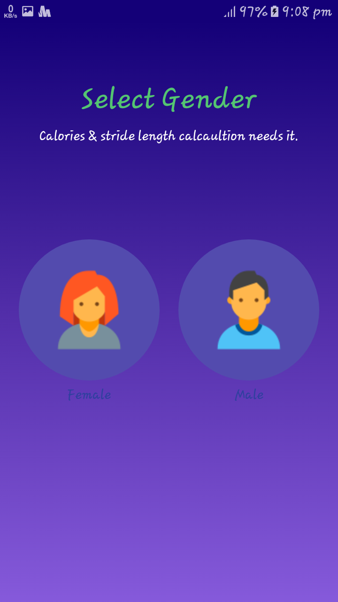 
    <th>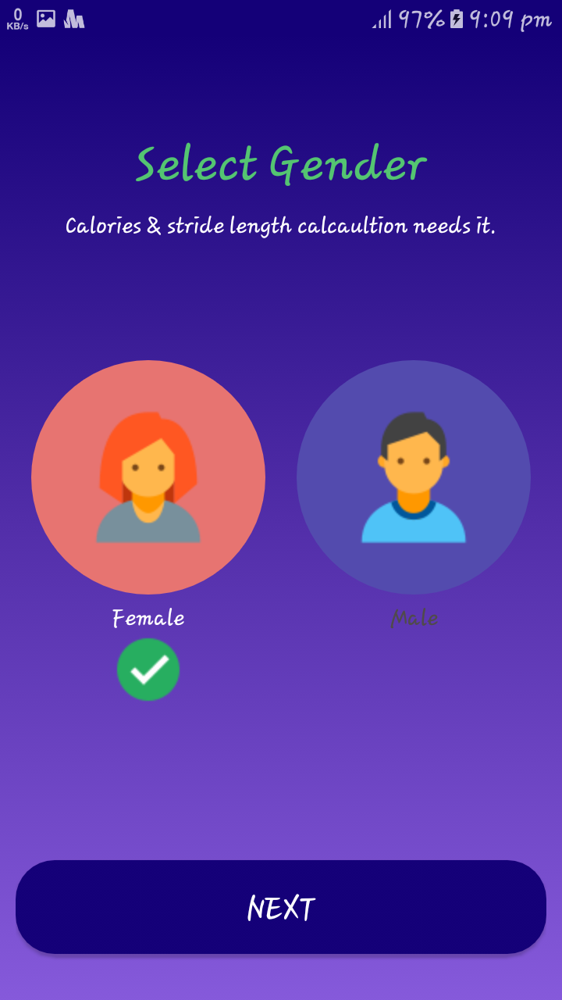
    <th>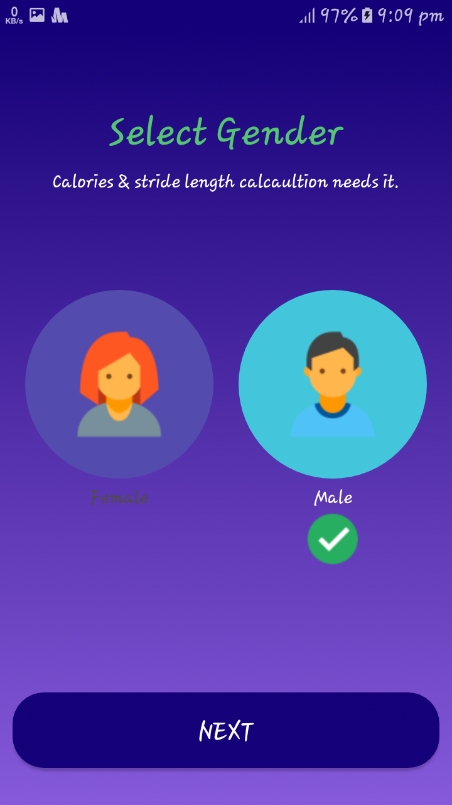
   </tr>
     <tr>
    <th>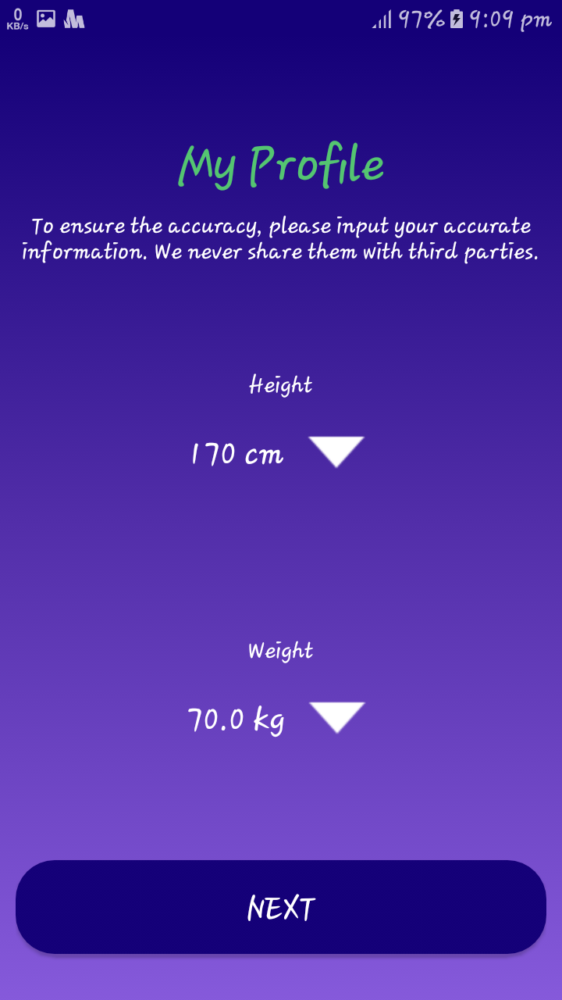
    <th>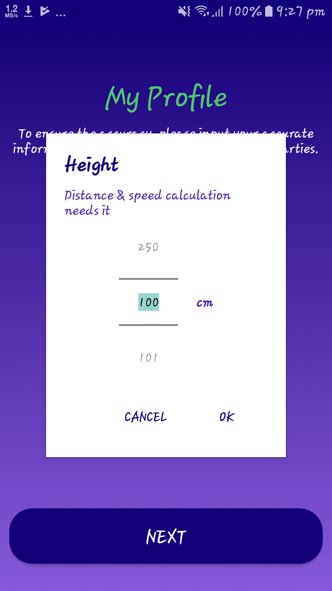 
    <th>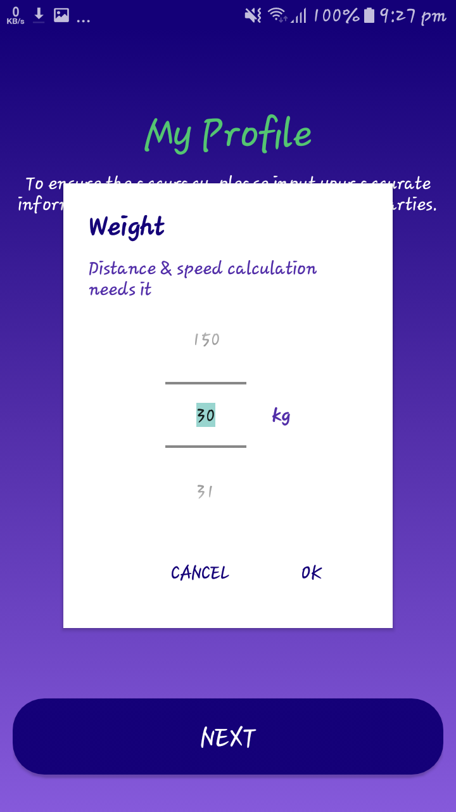
    <th>
   </tr>
     <tr>
    <th>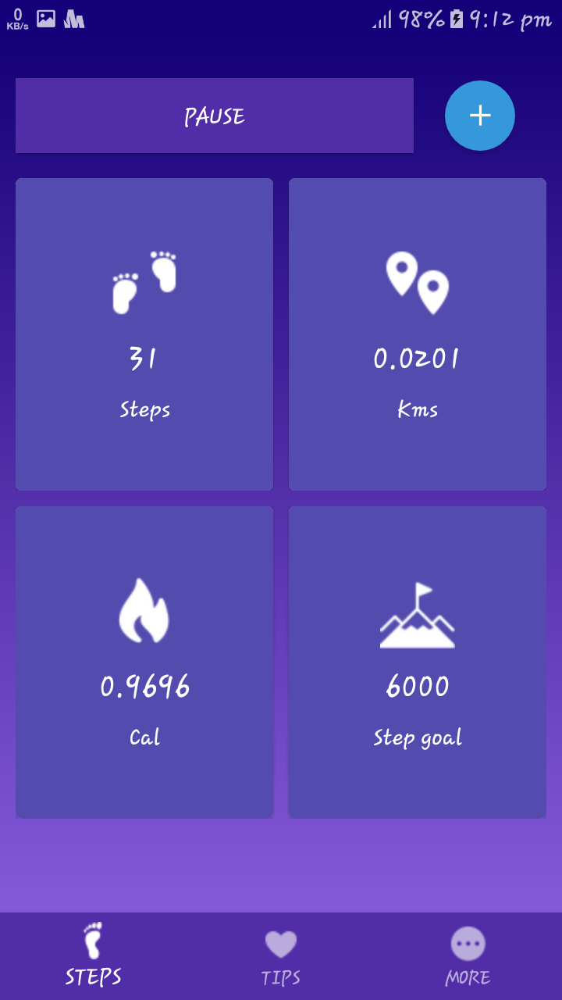
    <th>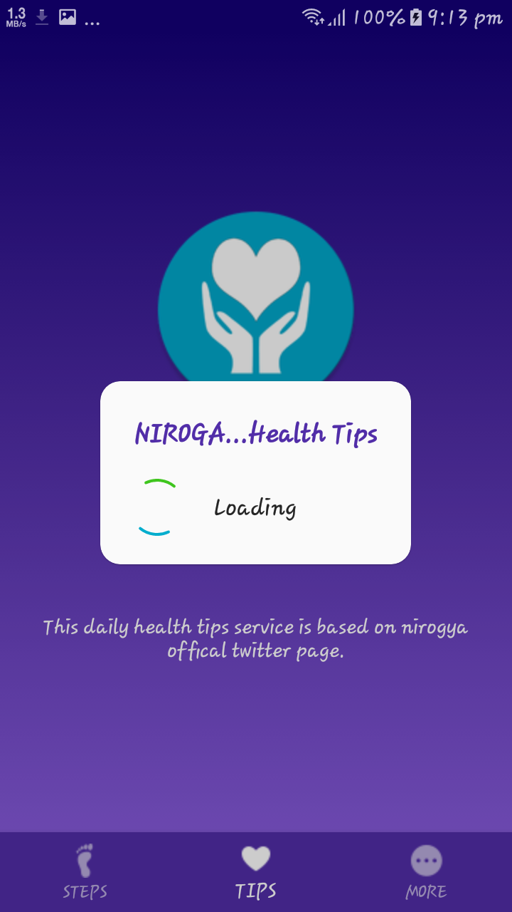 
    <th>
    <th>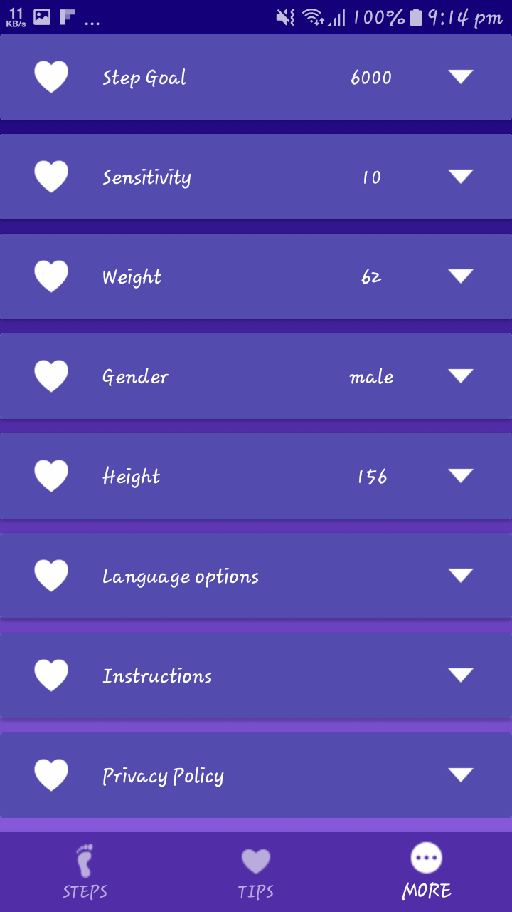
   </tr>
     <tr>
    <th>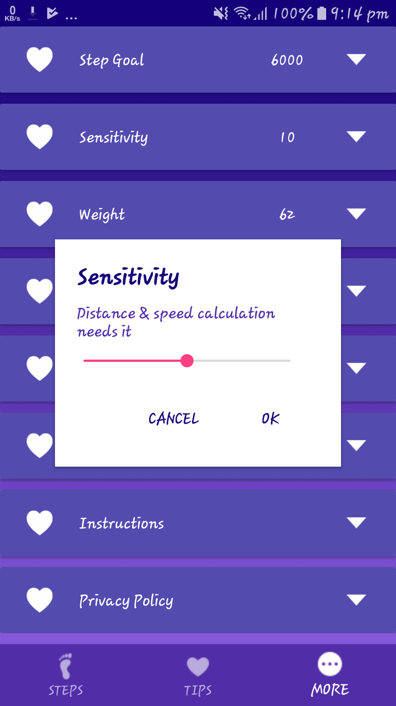
    <th> 
    <th>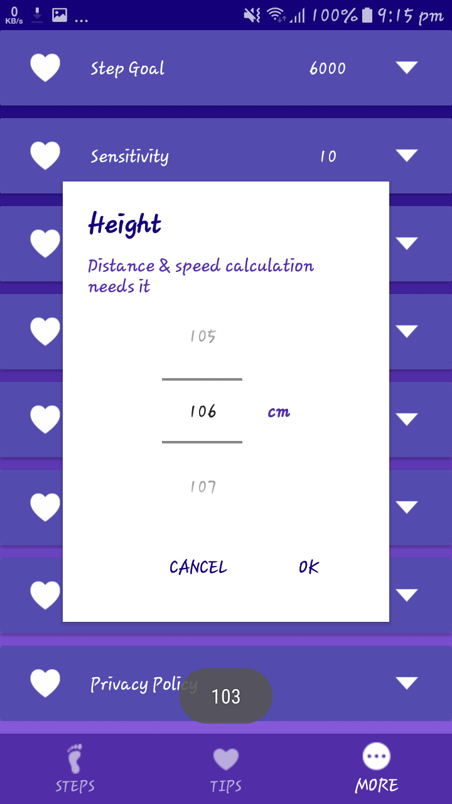
    <th>
   </tr>
     <tr>
    <th>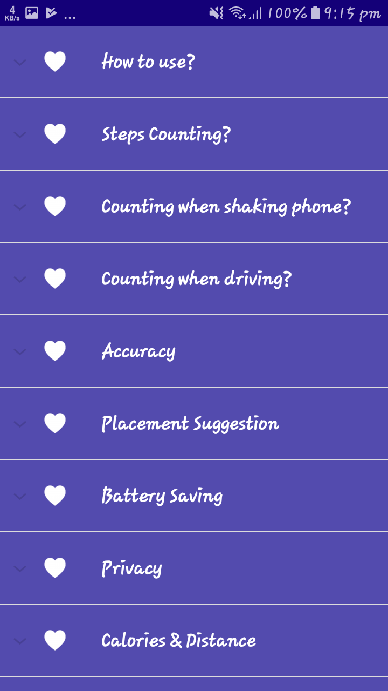
    <th>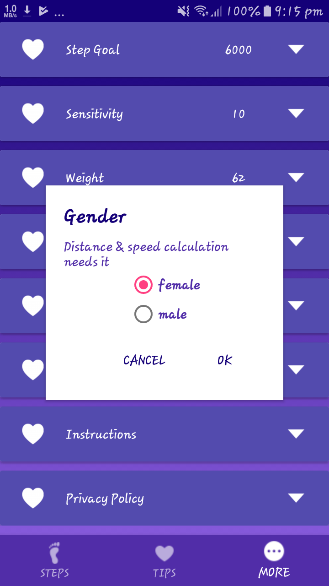 
    <th>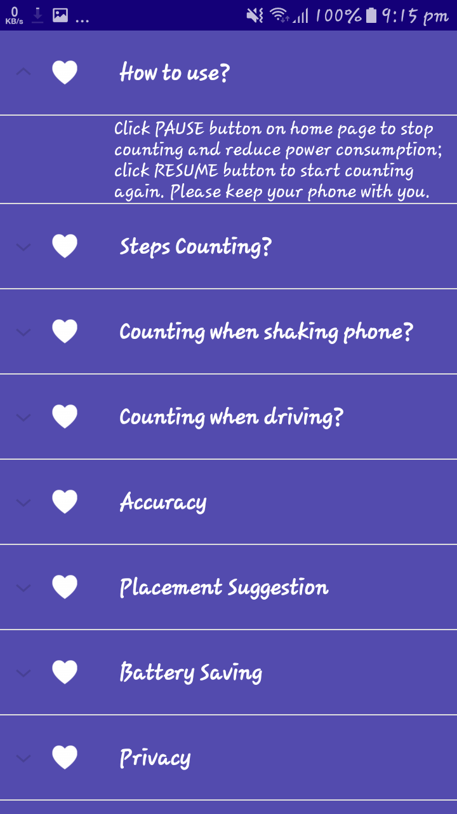
    <th>
   </tr>
</table>
<h2>Features</h2>

NIROGYA is based on codezilla hackathon requiremnt -Simple fitness android app that displays healthy tips from twitter stream daily and displays estimated calories burnt by analyzing foot step count

<ul>
<li>open the application</li>
<li>select gender </li>
<li>select height and weight</li>
</ul>

Now you have almost done. Please make sure to enter the accurate details of gender, weight & height because these data will be input to the programme to give you the best output through the application.

<ul>
<li>In the home page click on "start pedometer" button. It will start the counting your steps. you will be able to see the following changes while you are walking or running.</li>
<ul>
<li>Number of steps</li>
<li>The distance you have walked.</li>
<li>Calories you have burnt</li>
<li>and your default Step goal</li>
</ul>
</ul>

App uses only the accelerometer to determine peaks when the user takes a step. [ doesn't use GPS ]

<ul>
<li>Any time you can pause the pedometer and re-run from the last point you have stopped by clicking the above button. Each and every steps data is updated to the database. It will protect you all data.</li>
<li>click on the expandable button. </li>
<ul>
<li>Target achievements will be displayed by clicking the red button. Here I have given 3 achievements. </li>
<ul>
<li>bronze medal 10000 steps</li>
<li>silver medal 20000 steps</li>
<li>gold medal 30000 steps</li>

Earn three medals and live healthily.

</ul>
<li>You can reset all steps and related information by clicking on the green button.</li>
<li>The yellow button will help you to move directly to the Instructions page.</li>
</ul>
<li>click on the middle tab of the bottom navigation bar</li>
</ul>

It will show the daily health tips from twitter stream. Here I have created a twitter page -https://twitter.com/nirogya. Each day nirogya twitter page will be updated with new health tips. Android application will automatically link to that twitter page and day by day it will show the recent health tips. After loading a particular health tip from twitter nirogya page, the app will count down the remaining time to appear the next health tips. 

<ul>
<li>Click on the tab "MORE" of the bottom navigation bar. This is more than a setting page</li>
<ul>
<li>Default step goal is 6000. You have a chance to change your goal</li>
<li>The sensitivity of the step counter can be also changed. We have given you the best sensitivity by default. Any time you can change the sensitivity of a step and enjoy the pedometer.</li>
<li>Weight value can be changed.</li>
<li>Gender value can be changed.</li>
<li>Height value can be changed.</li>
<li>Currently, App is integrated with only English language.</li>
<li>Instructions also are there.</li>
<ul>
<li>How to use</li>
<li>Steps Counting?</li>
<li>Counting when shaking phone?</li>
<li>Counting when driving?</li>
<li>Accuracy</li>
<li>Placement Suggesstion</li>
<li>Battery Saving</li>
<li>Privacy</li>
<li>Calories & Distance.</li>
<li>Step goal</li>
</ul>
<li>finnally I have included the privacy policy of the application.</li>
</ul>
</ul>
<h2>Who do I talk to?</h2>
<ul>
  <li>Contributer: Kasun Chinthaka Piyarathna</li>
</ul>
<h2>Licence</h2>
  <li>This project is maintained under the MIT licence.</li>
<h2>Credits</h2>
 <ul>
   <li><a href="https://fitness.stackexchange.com/">Stack Exchange - Physical Fitness</a></li>
   <li><a href="https://twitter.com/">Twitter</a></li>
   <li><a href="https://www.facebook.com/mozillauwu/">Mozilla Campus Club - UWU</a></li> 
 </ul>
</body>
</html>
